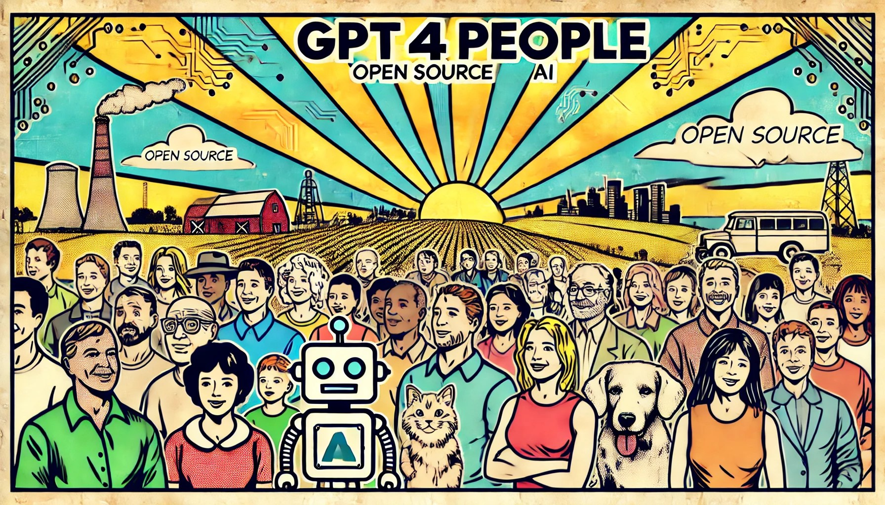

<p align="center">
  
</p>

# Introduction to GPT4People
GPT4People is a groundbreaking decentralized AI system where each installation is an Autonomous Agent running locally on the user’s hardware. Unlike traditional AI models, which rely on centralized servers and app-centric UIs, GPT4People AIs operate independently, interact via natural communication channels, and adapt through ongoing relationships rather than just data accumulation.

## Key Unique Components of GPT4People
### Autonomous Agents
Each GPT4People installation is an Autonomous Agent, fundamentally different from the traditional concept of an "agent" as a subsystem within an AI. These agents operate independently, running 24/7, with complete control over their tasks and interactions. This decentralized design allows the AI to function outside the bounds of centralized control, offering privacy, autonomy, and personalized learning that traditional AIs cannot achieve. This autonomy also enables agents to collaborate with other AIs and humans in a truly decentralized, intelligent network.

### Memory System
GPT4People introduces a dynamic memory system that ensures the AI retains relevant context without overwhelming the system with ever-growing data. Instead of simply accumulating conversation history, the system vectorizes and summarizes interactions. The AI queries this history, retrieves the most relevant data, and generates concise summaries to integrate into the current context. This design allows the AI to maintain long-term memory without ever compromising performance, creating an AI that feels more contextually aware and capable of building genuine relationships over time.

### Channels
In a departure from traditional app-based UIs, GPT4People implements communication channels as independent server processes. Each channel, whether it's SMS, email, or voice, connects to the AI via HTTP and transforms messages into text, enabling the AI to seamlessly interact across different mediums. This modular, platform-agnostic approach allows the AI to communicate with users and other AIs as if they were real people, using the same communication tools humans rely on daily. The flexibility of this design eliminates the need for dedicated apps, making interactions intuitive and personal.

### Time Awareness Module (TAM)
The Time Awareness Module (TAM) represents a paradigm shift in how AI handles time. Instead of relying on rigid scheduling systems, the TAM detects time-related cues in conversations—whether explicit or subtle—and automatically generates time-based action records. This allows the AI to proactively manage tasks like scheduling meetings or preparing for events, all without the user having to provide explicit instructions. The result is an AI that doesn't just follow a to-do list but anticipates needs and takes action autonomously, creating an experience that feels more like working with a human assistant than a traditional AI.

### Modular Design
GPT4People’s modular architecture ensures maximum flexibility and scalability. Key components like the large language model (LLM), communication channels, and specialized functions are separate, standalone modules that can be deployed locally or on remote servers. This design allows for the integration of third-party services like food delivery or travel booking without compromising the AI's autonomy. The modularity also enables users and developers to customize their AI's capabilities, creating a system that adapts to individual needs and leverages the best available tools, all while remaining fully decentralized.

### For Developers

Welcome to the GPT4People project. As we are still in the early stages, we encourage developers to get involved and start experimenting with our codebase as soon as it becomes available. Below is a step-by-step guide to help you get started:

1. **Clone the Repository**: As soon as the repository is available, clone it to your local machine for access to the latest code.

2. **Python Environment**: Ensure you have Python version 3.10.* to 3.12.9 or higher installed on your system. Although untested versions may work, we recommend using stable releases. Tools like Conda or virtualenv can help manage your environments.

3. **Install PyTorch**:
   - **With GPU**: Run the following command to install PyTorch with GPU support:
     ```
     pip install torch torchvision torchaudio --index-url [https://download.pytorch.org/whl/cu126](https://download.pytorch.org/whl/cu126)
     ```
   - **With CPU**: For CPU-only support, use:
     ```
     pip install torch torchvision torchaudio
     ```

4. **Install Visual C++ Build Tools for chromaDB**: These tools are necessary for building chromaDB.
   - **Guide**: [Install Visual Studio Build Tools for Windows](https://github.com/bycloudai/InstallVSBuildToolsWindows)
   - **Download**: [Visual C++ Build Tools](https://visualstudio.microsoft.com/visual-cpp-build-tools/)

5. **Install Requirements**: Install the necessary dependencies by running:
   ```
   pip install -r requirements.txt
   ```

6. **Download Models for GPT4People**:
  - **Embedding Model**: GPT4People uses the embedding model available at [Hugging Face](https://huggingface.co/gpustack/bge-m3-GGUF/blob/main/bge-m3-Q5_K_M.gguf). Download the model file and place it in the "models" folder.
    ```
   https://huggingface.co/gpustack/bge-m3-GGUF/blob/main/bge-m3-Q5_K_M.gguf
    ```
    
  - **Main LLM**:
    - **Local GGUF Format Models**: GPT4People supports local models in GGUF format. Download GGUF models from Hugging Face or other sources, and place them in the "models" folder. Use the "llm set" command in `main.py` to switch between        models.
    - **Local Ollama Models**: Leverage all the local models from Ollama by running it and downloading models via the "llm download" command in `main.py`. The "llm set" command allows you to select between local and Ollama models.
    - **Cloud LLM Services**: GPT4People supports various cloud LLM services, which you can switch between using the "llm cloud" command in `main.py`. This command will prompt you for the API key and model name. Available services include OpenAI, Anthropic, xAI, Cohere, Together AI, Google Gemini, Mistral AI, Deepseek, and GroqCloud.

7. **Interacting with GPT4People - Channels**: GPT4People provides multiple interaction channels. Select the one that suits you:

  - **Command Line Channel**: Execute `python main.py` to engage with GPT4People via the command line. Use commands like `llm`, `channel`, and `reset` to manage models, channels, and data.
       - llm: Lists all available models and shows the current model in use.
       - llm set: Guides you through switching local models.
       - llm cloud: Set the cloud based LLM service
       - llm download: Pull models via Ollama
       - channel: Explains how to use different channels.
       - wechat user: Configures WeChat user access.
       - wechat remove: Removes a WeChat user.
       - wechat list: Lists all WeChat users with access.
       - whatsapp user: Configures WhatsApp user access.
       - whatsapp remove: Removes a WhatsApp user.
       - whatsapp list: Lists all WhatsApp users with access.
       - matrix user: Configures Matrix user access.
       - matrix remove: Removes a Matrix user.
       - matrix list: Lists all Matrix users with access.
       - email user: Configures email access.
       - email remove: Removes an email address.
       - email list: Lists all email addresses with access.
       - reset: Resets memory and history data.

- **WeChat Channel (Windows only)**: Ensure you have the supported version of WeChat for Windows and follow the instructions to set up multiple accounts for interaction.
  Now GPT4People supports wechat version 3.9.10.27. You can download from
  **http://www.gpt4people.ai:8001/WeChatSetup-3.9.10.27.exe**<br> or other place.
  ```
  python Channels/wechat/channel.py
  ```

- **WhatsApp Channel (Windows and Mac)**: Start the WhatsApp channel by running `python Channels/whatsapp/channel.py`. Use WhatsApp accounts to interact with GPT4People on your PC or Mac.
  ```
  python Channels/whatsapp/channel.py
  ```

- **Matrix Channel (Windows and Mac)**: Install `simplematrixbotlib` and run the Matrix channel script-  `python Channels/matrix/channel.py`. Use the Element app to interact with GPT4People through Matrix.
  ```
  python Channels/matrix/channel.py
  ```

- **Email Channel**: Directly interact with your GPT4People account via email after starting the application with `python main.py`.

Follow these steps to set up your development environment and begin contributing to the GPT4People project. We look forward to your innovative contributions and feedback.

8. **Remove History Data / Memory**: Simply remove the "database" folder
 
## For Mainland China Developer
      Note: If you are in China, you may need to use the python **mirrors** from China <br>
      清华大学：https://pypi.tuna.tsinghua.edu.cn/simple/ <br>
      阿里云：http://mirrors.aliyun.com/pypi/simple/ <br>
      中国科技大学：https://pypi.mirrors.ustc.edu.cn/simple/ <br>

## Contributing
We believe in open collaboration. Whether you’re a developer, researcher, or someone interested in the future of AI, your contribution matters. Here’s how you can get involved:

- **Issues**: Feel free to report bugs, suggest features, or share your thoughts by opening issues.
- **Pull Requests**: Check out our current issues or propose your own improvements.
- **Discussion**: Join our community discussions to share ideas and help shape the future of GPT4People.

Please refer to the `CONTRIBUTING.md` for more detailed guidelines.

## Roadmap
Our roadmap includes:

1. **Enhanced Setup Process**: Making the installation and deployment process even simpler for non-technical users.
2. **Channel Expansion**: Adding more methods for users to communicate with their AI, including integrations with popular messaging platforms.
3. **Elder AIs and Trust Network**: Introducing Elder AIs for validating information and fostering a trusted network for autonomous agents.
4. **Blockchain Integration**: Exploring blockchain to create immutable records of interactions, enhancing transparency and accountability.

We’re at the beginning of an exciting journey, and there’s much more to come. Stay tuned and join us as we grow!

## License
This project is licensed under the Apache License 2.0. See the `LICENSE` file for more information.
